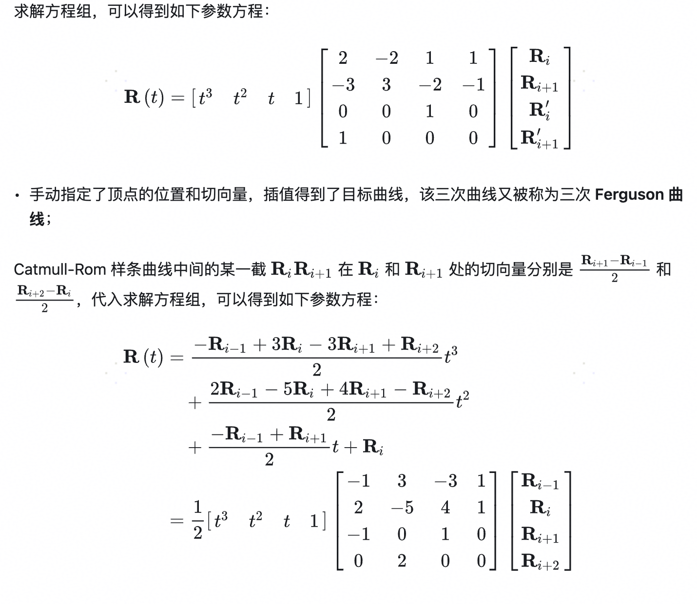

## 曲线绘制

### Catmull-Rom 曲线



```js
function catmullRomSpline(t, p0, p1, p2, p3) {
  const t2 = t * t;
  const t3 = t2 * t;
  return (
    0.5 *
    (2 * p1 +
      (p2 - p0) * t +
      (2 * p0 - 5 * p1 + 4 * p2 - p3) * t2 +
      (3 * p1 - p0 - 3 * p2 + p3) * t3)
  );
}
```

### 三次贝塞尔曲线

> B(t) = (1-t)^3 _ P0 + 3 _ (1-t)^2 _ t _ P1 + 3 _ (1-t) _ t^2 _ P2 + t^3 _ P3

### 浏览器利用 Catmull-Rom 曲线绘制三次贝塞尔

[参考：https://link.springer.com/article/10.1007/s42979-021-00770-x ](https://link.springer.com/article/10.1007/s42979-021-00770-x)

由于浏览器能画的是 bezier. 因此如果要用 bezier 来画的话, 要得到 bezier 控制点
bezier 控制点与 P0, P1, P2, P3 有关. 公式在 pdf `文章` [15]

Bezier 对应点
P1
P1 + (P2 - P0) / (6 · τ) => Bezier 控制点
P2 - (P3 - P1) / (6 · τ) => Bezier 控制点
P2

直接输入到 svg 上就可以了

如果要根据 t 计算点(动画缓动会用到). 就需要用到具体公式

bezier 点生成 p0 = p1, p1 = p1 + (p2-p0)*t/3, p2 = p2 - (p3-p1)*t/3, p3 = p2

### Demo

[canvas 曲线绘制.html](./canvas曲线绘制.html)
