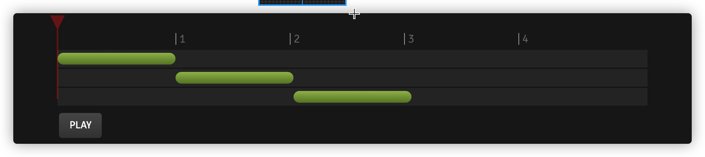
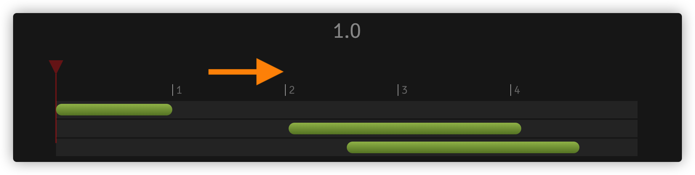

### 一、前端动画框架

#### 动画

1. [GSAP(GreenSock Animation Platform)](https://greensock.com/docs/v3)，动画管理工具
2. Lottie，配合 UI 设计师设计的动画导出通用的 json 数据进行动画设置，web 端包是 lottie-web

#### 渲染框架

1. [PixiJS](https://pixijs.com/)
2. [CreateJS](https://createjs.com/)
3. [Three.js](https://threejs.org/)的 3D 渲染, 都是基于 WebGL，而 WebGL 都是依赖于 OpenGL(Mac/Linux 等)或者 DirectX(windows)，Apple 设备的渲染以后会转成都用 Metal 绘制
4. Web 游戏，2d、3d 都可， [Cocos Creator](https://www.cocos.com/docs) ，底层是 c++实现
5. 未来，基于 WebGPU 的图像渲染前端技术，真 3D 图形和计算能力

### 二、GSAP 效果

1. [官网 showcase](https://greensock.com/showcase/)
2. 年度账单合成效果
3. [我的 codepen](https://codepen.io/your-work)
4. 引申[requestAnimationFrame](https://developer.mozilla.org/zh-CN/docs/Web/API/Window/requestAnimationFrame)

> 告诉浏览器，你希望执行一个动画，并且要求浏览器在下次重绘之前调用指定的回调函数更新动画。
> 该方法需要传入一个回调函数作为参数，该回调函数会在浏览器下一次重绘之前执行,重绘。浏览器一般刷新频率为 60fps
> 下一次重绘之前更新动画帧所调用的函数(即上面所说的回调函数)。
> 该回调函数会被传入 DOMHighResTimeStamp 参数，该参数与 performance.now()的返回值相同，它表示 requestAnimationFrame() 开始去执行回调函数的时刻。

### 三、GSAP 简单使用

1. **时序概念** Sequencing with Timelines，简单地说就是顺序和时间

css 动画

```css
@keyframes move {
  0% {
  }
  ... 100% {
  }
}
.box {
  /* animation: name duration timing-function delay iteration-count direction fill-mode; */
  animation-duration: 1s;
  animation-delay: 1s;
  /* transition-duration和transition-delay */
}
```

矩阵变换使用

```css
.box {
  /* 2d矩阵变换 matrix方法有六个参数matrix(a, b, c, d, x, y)，六个参数默认值是matrix(1, 0, 0, 1, 0, 0)，这六个参数分别控制不同的变换
a 水平缩放
b 水平拉伸
c 垂直拉伸
d 垂直缩放
x 水平位移
y 垂直位移 */
  transform: matrix(...);
  /* 4*4 仿射矩阵变换 */
  transform: matrix3d(...);
}
```

2. **Tween** 补间动画

```js
const tween = gsap.to("#id", { x: 100, duration: 1 });
```

3. **Timeline** 时间轴，它也是个容器

```js
const tl = gsap.timeline();
```

4. **顺序**，position 位置参数使用



```js
const tl = gsap.timeline();
tl.to("#green", { duration: 1, x: 750 })
  .to("#blue", { duration: 1, x: 750 }, "-=1")
  .to("#orange", { duration: 1, x: 750 }, "<");
```

重点讲下标签 label

```js
const tl = gsap.timeline();
tl.to("#green", { duration: 1, x: 750 })
  .add("mylabel", "+=1")
  .to("#blue", { duration: 2, x: 750, rotation: 360 }, "mylabel")
  .to("#orange", { duration: 2, x: 750, rotation: 360 }, "mylabel+=0.5");
```



position 理解[https://gsap.com/resources/position-parameter/](https://gsap.com/resources/position-parameter/)
“+=” “-=” 是相对于当前 timeline 来计算的
“<” “>”是相对于上一个动画来计算的

- "+=1" - 1 second past the end of the timeline (creates a gap)
- "-=1" - 1 second before the end of the timeline (overlaps)
- "myLabel+=2" - 2 seconds past the label "myLabel"
- "<+=3" - 3 seconds past the start of the previous animation
- "<3" - same as "<+=3" (see above) ("+=" is implied when following "<" or ">")
- ">-0.5" - 0.5 seconds before the end of the previous animation. It's like saying "the end of the previous animation plus -0.5"

5. **管理时间轴**

   > 主时间轴添加模块化的各个动画时间轴,时间轴嵌套时间轴

```js
const master = gsap.timeline();
master.add(tl1).add(tl2).add(tl3)...
```

### 四、年度账单相关应用

1. 图片过场动画

- boxshadow
- clip-path
- mask
- animation/gsap

2. 碎片合成动画

- transfrom
- gsap 的 add,嵌套时间轴

### 五、在 Canvas 或其它 上使用

1. 操作自定义普通对象
2. 常用回调（监听）函数使用

- onStart
- onUpdate
- onComplete

3. 其他属性

- stagger
- keyframes
- ....

### 六、破解插件

> 源码都拿到了，看我怎么破解你: 关键点插件里面找到**匹配 host 的函数**，屏蔽掉即可

> tips: 最好不用拿收费的插件用于商业用途
