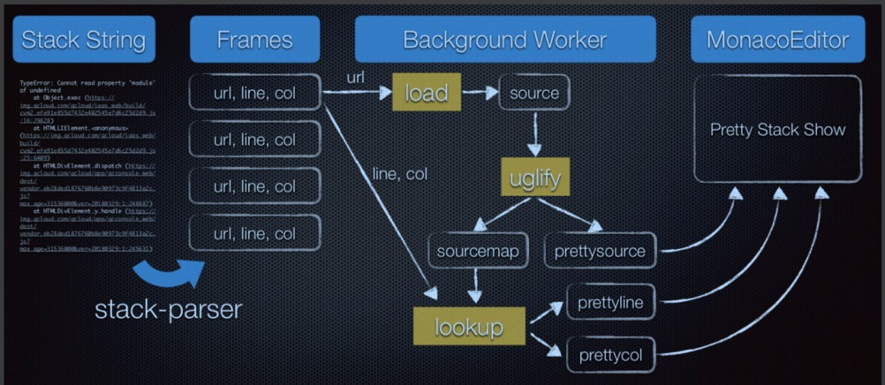

## 一、为什么要搭建监控系统
1. 性能监控，性能
2. 异常监控，稳定性
3. 数据埋点，数据

## 二、性能监控
1. 加载性能：加载时间，首屏可交互时间（FMP）
2. 渲染性能：帧率、渲染时间、响应速度、交互反馈
问题：
1. 前端加载性能都包含什么？
2. 前端渲染性能都包含什么？
3. 如何检测性能数据？
4. 数据如何上报？
5. 数据如何存储查询？

浏览器performance api

## 三、异常监控
1. 前端有哪些异常？
2. 如何捕获异常？
3. 异常如何上报？
4. 为什么要SourceMap?
5. SourceMap怎么用？
6. Sentry开源系统介绍

### 前端异常

1. JavaScript运行错误
EvalError: eval()函数中发生的错误
InternalError: eval()函数中发生的错误
RangeError: 超出数字范围错误
ReferenceError: 非法引用
SyntaxError: 语法错误
TypeError: 类型错误
URIError: encodeURI中发生的错误
异步异常：
setTimeout、Promise、setInterval、requestAnimationFrame
2. 网络加载错误
加载失败：link script img css
3. HTTP请求错误
XMLHttpRequest、Fetch

### 异常捕获
1. try catch
2. window.onerror 全局捕获 message(错误信息),url,lineno,colno,error(Error对象),error.stack错误堆栈
onerror缺点：只能绑定一个监听方法；回调的参数过于离散；
特性：只有onerror才能阻止抛出错误到控制台

监听资源出错：
```js
window.addEventListener('error',function (e) {
    console.log('捕获报错：', e)
    if(e.target.tagName.toUpperCase() === 'IMG'){
        console.log('img error')
    }
},true);//捕获阶段

```


3. Promise异常

```js
 window.addEventListener('unhandledrejection',function(e){
    //处理未处理的拒绝...
    //防止默认处理(例如将错误输出到控制台)
    console.log('unhandledrejection:',e);
    e.preventDefault();
  },false)
  // 当一个Promise错误最初未被处理，但是稍后又得到了处理，则会触发rejectionhandled事件：
  window.addEventListener('rejectionhandled',function (e) {
     //处理未处理的拒绝...
    //防止默认处理(例如将错误输出到控制台)
    console.log('rejectionhandled:',e);
    e.preventDefault();
  },false)
```

4. 跨域脚本捕获
为了性能方面考虑，一般脚本会放到CDN，这种方式会大大加快首屏时间。但是，脚本报错，因为跨域不容易捕获。
浏览器只允许同域下的脚本捕获具体的错误信息
 
 方案一：设置crossorigin = "anonymous"；可以通过设置webpack插件自动添加
 Access-Control-Origin: * (或者是域名)
 ```js
 <script crossorigin src="http://www.lmj.com/demo/crossoriginAttribute/error.js"></script>
 ```
 方案二：对所有原生方法进行代理，但是很难覆盖所有的原生方法，可以实现对常用的代理
```js
//包装异步操作，用于捕获错误
function _myErrorCatch(e) {
    console.log('处理监听到的错误：',e);
}
function wrapFunction(fn) {
  return function () {
    try {
        // fn.call(this,...arguments)
        fn.apply(this,arguments)
    } catch (error) {
      console.log("异步操作抛出错误：", error);
      _myErrorCatch(error)
    }
  };
}
const _setTimeout = globalThis.setTimeout;
function setTimeout(fn, timeout) {
  _setTimeout(wrapFunction(fn), timeout);
}
//例如
setTimeout(() => {
    a = a + 1;
}, 1000);
```

5. Vue，React等框架内部实现的api
Vue Error Handler
```js
Vue.config.errorHandler = (err,vm,info) => {
    console.log('通过vue errorHandler捕获错误')
}
```

6. HTTP 请求错误
AOP同理，是包装fetch 和 XMLHttpRequest

7. 网页崩溃捕获
网页 <= Heartbeat => Service Worker

### 错误上报
1. XMLHttpRequest
2. navigator.sendBeacon
3. IndexedDB缓存，可以去重处理数据等等，然后异步上传
4. 页面截图录屏等，html2canvas
5. 稀释数据减轻服务器压力
```js
    if(Math.random() < 0.5){
        //只采集50%，上报信息
        send(data)
    }
```
### SourceMap

1. SourceMap 规范
```js
    {
        version: 3,
        file: 'main.js',
        name: ['bar','n'],
        sources: ['one.js','xx.js'],
        sourceRoot: 'http://xxx/www/js',
        mappings: "CAAC,IAAI,..."
    }
```
2. 编码采用的是Base64 VLQ编码
规则：
2.1 取数字1024， 10 000000000
2.2 在最右边补充符号位，因为1024是正数，所以最右边补充一个0——10 00000 00000，此时一共12位；
2.3 现在从最右边向左边每隔5位划分为一组，不足五位的左边补充0——00010 00000 00000，一共15位；
2.4 将组的位置顺序颠倒一下——00000 00000 00010；
2.5 在最左边为每组补充一位，如果这组是这个数值的最后一组，那么就补充0，前面的组都补充1——100000 100000 000010(32 32 2)，一共18位；
2.6 对照base64字符表转为字符

3. mappings详解
比如：mappings:"AAAAA,BBBBB;CCCCC"
```
mappings = [
[ [生成文件的列，源文件索引，源文件行号，源文件列号，名称索引], ...], // 第1行第1个映射点，第1行第2个映射点， ...
[ [生成文件的列，源文件索引，源文件行号，源文件列号，名称索引], ...] // 第2行第1个映射点，第2行第2个映射点， ...
]

映射点的三种情况：
[生成文件的列]
[生成文件的列，源文件索引，源文件行号，源文件列号]
[生成文件的列，源文件索引，源文件行号，源文件列号，名称索引]

源映射所有的行列号都是从0开始计数的。
```

4. 错误堆栈查看工具
4.1 堆栈解析 stack-parser
https://github.com/stacktracejs/error-stack-parser

4.2 UglifyJS 反向美化
通过SourceMap找到原行和列号

4.3 Monaco Editor 显示


### Sentry
开源的实时错误追踪系统
搭建
docker运行
镜像：https://github.com/getentry/onpremise
