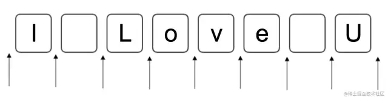

# 正则表达式

## 正则的核心

正则就是匹配模式，要么匹配位置，要么匹配字符。划重点，牢记这个核心。


上图代表的是一个字符串：I Love U，箭头就表示我们要匹配的位置，框框里就表示我们要匹配的字符(包括空格)。相信小伙伴们一眼就看明白了。

**匹配位置**
正则中可以匹配位置的方式如下：

| 模式        | 重要说明                                                     |
| ----------- | ------------------------------------------------------------ |
| ^           | 匹配开头的位置，当正则有修饰符 m 时(多行文本)，表示匹配行开头位置。 |
| $           | 匹配结尾的位置，当正则有修饰符 m 时(多行文本)，表示匹配行结尾位置。 |
| \b          | 匹配单词边界，即匹配上面示例中的 i、love、U 前后的位置       |
| \B          | 匹配非单词边界，与 \b 相反，即匹配上面示例中的 o、v、e 前后的位置 |
| (?=表达式)  | **正向先行断言**：`(?=表达式)`，指在某个位置的右侧必须能匹配表达式。<br/>例如： 给定字符串`我爱你 我爱他 我爱 爱你 我和你`，匹配右边是“你”的位置。 <br/>正则可以这么写: `/(?=你)/g`  **我`爱`你 我爱他 我爱 `爱`你 我`和`你** 如果非要加上“爱”，`/爱(?=你)/g`，就会匹配出 `爱你` |
| (?!表达式)  | **反向先行断言**：`(?!表达式)`，指在某个位置的右侧不能匹配表达式。与 `(?=表达式)`正好相反。<br/>同样是上面的例子:`/爱(?!你)/g`，就会匹配出 |
| (?<=表达式) | **正向后行断言**：`(?<=表达式)`，指在某个位置的左侧必须能匹配表达式。<br/>**注意: 先行断言和后行断言只有一个区别，即先行断言从左往右看，后行断言从右往左看。** |
| (?<!表达式) | **反向后行断言：**`(?<=表达式)`，指在某个位置的左侧必须能匹配表达式。 |

 

**匹配字符**

接下来我们看下正则中可以匹配字符的方式：

**字符**

| 模式       | 说明                                                                   |
| :--------- | :--------------------------------------------------------------------- |
| 字母、数字 | 匹配字符本身。比如/javascript/，匹配 "javascript"；/123/，匹配 "123"。 |
| \0         | 匹配 NUL 字符。                                                        |
| \t         | 匹配水平制表符。                                                       |
| \v         | 匹配垂直制表符。                                                       |
| \n         | 匹配换行符。                                                           |
| \r         | 匹配回车符。                                                           |
| \f         | 匹配换页符。                                                           |
| \xnn       | 匹配拉丁字符。比如 \xOA 等价于 \n。                                    |
| \uxxxx     | 匹配 Unicode 字符。比如 \u2028 匹配行终止符，\u2029 匹配段终止符。     |
| \cX        | 匹配 ctrl+X。比如 \cI 匹配 ctrl+I，等价于 \t。                         |
| [\b]       | 匹配 Backspace 键(特殊记忆)。                                          |

**字符组**

| 模式      | 说明                                                                 |
| :-------- | :------------------------------------------------------------------- |
| [abc]     | 匹配 "a"、"b"、"c" 其中任何一个字符。                                |
| [a-d1-4]  | 匹配 "a"、"b"、"c"、"d"、"1"、"2"、"3"、"4" 其中任何一个字符。       |
| [^abc]    | 匹配除了 "a"、"b"、"c" 之外的任何一个字符。                          |
| [^a-d1-4] | 匹配除了 "a"、"b"、"c"、"d"、"1"、"2"、"3"、"4" 之外的任何一个字符。 |
| .         | 通配符，匹配除了少数字符(\n)之外的任意字符。                         |
| \d        | 匹配数字，等价于 [0-9]。                                             |
| \D        | 匹配非数字，等价于 [^0-9]。                                          |
| \w        | 匹配单词字符，等价于 [a-zA-Z0-9_]。                                  |
| \W        | 匹配非单词字符，等价于 [^a-zA-Z0-9_]。                               |
| \s        | 匹配空白符，等价于 [ \t\v\n\r\f]。                                   |
| \S        | 匹配非空白符，等价于 [^ \t\v\n\r\f]。                                |

**量词**

| 模式   | 说明                                          |
| :----- | :-------------------------------------------- |
| {n,m}  | 连续出现 n 到 m 次。贪婪模式。                |
| {n,}   | 至少连续出现 n 次。贪婪模式。                 |
| {n,}   | 至少连续出现 n 次。贪婪模式。                 |
| {n}    | 连续出现 n 次。贪婪模式。                     |
| ?      | 等价于 {0,1}。贪婪模式。                      |
| +      | 等价于 {1,}。贪婪模式。                       |
| \*     | 等价于 {0,}。贪婪模式。                       |
| {n,m}? | 连续出现 n 到 m 次。惰性模式。最多匹配到 n 个 |
| {n,}?  | 至少连续出现 n 次。惰性模式。最多匹配到 n 个  |
| {n}?   | 连续出现 n 次。惰性模式。                     |
| ??     | 等价于 {0,1}?。惰性模式。                     |
| +?     | 等价于 {1,}?。惰性模式。                      |
| \*?    | 等价于 {0,}?。惰性模式。                      |

- **贪婪模式――在匹配成功的前提下，尽可能多的去匹配**
- **惰性模式――在匹配成功的前提下，尽可能少的去匹配**

**括号的作用**

| 模式           | 说明                                                                      |
| :------------- | :------------------------------------------------------------------------ |
| (ab)           | 捕获型分组。把 "ab" 当成一个整体，比如 (ab)+ 表示 "ab" 至少连续出现一次。 |
| (?:ab)         | 非捕获型分组。与 (ab) 的区别是，它不捕获数据。                            |
| (good\|nice)   | 捕获型分支结构。匹配 "good" 或 "nice"。                                   |
| (?:good\|nice) | 非捕获型分支结构。与 (good\|nice) 的区别是，它不捕获数据。                |
| \num           | 反向引用。比如 \2，表示引用的是第二个括号里的捕获的数据。                 |

括号主要是用来分组作用

**简单题目**

1. 匹配爱后面不包含你的数据

   ```js
   /我爱[^你]/.test("我爱你"); // false
   // 匹配不包含.
   /^[^.]*$/.test("sdfa.sdf"); // false
   ```

2. 仅匹配有边界的`code`单词

   ```
   /\bcode\b/.test('bar code'); // true

   /\bcode\b/.test('barcode') // false
   ```

3. 匹配姓“李”的名字。

   ```
   /^李.+/.test('李逍遥');  // true

   /^李.+/.test('慕容李逍遥');  // false

   // "李" 左侧可以为空格不能为非空格字符
   /(?<=[\s]?)(?<!\S)李.+/.test('李逍遥');  // true
   ```

4. 视频文件的后缀名有 .mp4、.avi、.wmv、.rmvb 用正则表达式提取所有的视频文件的后缀

   ```js
   const regex = new RegExp(/.+(.mp4|.avi|.wmv|.rmvb)/);
   
   regex.exec("海贼王.avi");
   // ['海贼王.avi', '.avi', index: 0, input: '海贼王.avi', groups: undefined]
   regex.test("朋友.mp3");
   // null
   regex.test("学习资料.rmvb");
   // ['学习资料.rmvb', '.rmvb', index: 0, input: '学习资料.rmvb', groups: undefined]
   ```

## 正则表达式相关 API

Javascript 中可以通过以下两种方式写正则:

1. 正则表达式字面量

2. 通过构造函数 RegExp 的实例

### **修饰符**

| 模式 | 说明                                                                                                 |
| :--- | :--------------------------------------------------------------------------------------------------- |
| g    | **global 简写**，全局匹配，找到所有满足匹配的子串，而不是默认只匹配首次结果。                        |
| i    | **ignore case 简写**，匹配过程中，忽略英文字母大小写，如 `/test/i` 可以匹配 Test、teSt、TesT 等。    |
| m    | **multiline 简写**，多行匹配，把 ^ 和 $ 变成行开头和行结尾。比如可以匹配文本域(textarea)元素中的值。 |
| u    | **unicode 简写**，允许使用 Unicode 点转义符。                                                        |
| y    | **sticky 简写**，开启粘连匹配，正则表达式执行粘连匹配时试图从最后一个匹配位置开始。                  |

### RegExp 相关实例方法

| 模式        | 说明                                                                                                                                  |
| :---------- | :------------------------------------------------------------------------------------------------------------------------------------ |
| **test** | 判断目标字符串中是否有满足正则匹配的子串。返回布尔值。                                                                                |
| **exec** | 比 **match** 更强大的正则匹配操作。如果正则表达式不包含 g 标志，**str.match\(\)** 将返回与 **RegExp.exec\(\)**  相同的结果。 |

### RegExp 静态属性

| 模式                | 说明                                                |
| :------------------ | :-------------------------------------------------- |
| 1,...,1,...,1,...,9 | 最近一次第 1-9 个分组捕获的数据。                   |
| input               | 最近一次目标字符串，可以简写成 $\_ 。               |
| lastMatch           | 最近一次匹配的文本，可以简写成 $& 。                |
| lastParen           | 最近一次捕获的文本，可以简写成 $+ 。                |
| leftContext         | 目标字符串中 lastMatch 之前的文本，可以简写成 $` 。 |
| rightContext        | 目标字符串中 lastMatch 之后的文本，可以简写成 $' 。 |

### String 相关实例方法

| 模式          | 说明                                                                   |
| :------------ | :--------------------------------------------------------------------- |
| **search** | 返回正则匹配到的第一个子串在目标字符串中的下标位置。                   |
| **split**  | 以正则匹配到的子串，对目标字符串进行切分。返回一个数组。               |
| **match**  | 对目标字符串执行正则匹配操作，返回的匹配结果数组中包含具体的匹配信息。 |

- groups: 一个命名捕获组对象，其键是捕获组名称，值是捕获组，如果未定义命名捕获组，则为 **undefined**。有关详细信息，请参阅**组和范围**。
- index: 匹配的结果的开始位置
- input: 搜索的字符串。 | | **replace** | 对目标字符串进行替换操作。正则是其第一个参数。返回替换后的字符串。

#### replace 第二个参数中的特殊字符

| 模式            | 说明                           |
| :-------------- | :----------------------------- |
| 1,1,1,2,...,$99 | 匹配第 1-99 个分组里捕获的文本 |
| $&              | 匹配到的子串文本               |
| $`              | 匹配到的子串的左边文本         |
| $'              | 匹配到的子串的右边文本         |
| $$              | 美元符号                       |

#### replace 第二个参数为函数

你可以指定一个函数作为第二个参数。在这种情况下，当匹配执行后，该函数就会执行。 函数的返回值作为替换字符串。 (注意：上面提到的特殊替换参数在这里不能被使用。) 另外要注意的是，如果第一个参数是正则表达式，并且其为全局匹配模式，那么这个方法将被多次调用，每次匹配都会被调用。

| 变量名            | 代表的值                                                                                                                                                                                                |
| :---------------- | :------------------------------------------------------------------------------------------------------------------------------------------------------------------------------------------------------ |
| match             | 匹配的子串。（对应于上述的$&。）                                                                                                                                                                        |
| `p1,p2, ...`      | 假如 replace() 方法的第一个参数是一个**RegExp** 对象，则代表第 n 个括号匹配的字符串。（对应于上述的 1，1，1，2 等。）例如，如果是用 /(\a+)(\b+)/ 这个来匹配，p1 就是匹配的 \a+，p2 就是匹配的 \b+。 |
| `offset`          | 匹配到的子字符串在原字符串中的偏移量。（比如，如果原字符串是 'abcd'，匹配到的子字符串是 'bc'，那么这个参数将会是 1）                                                                                    |
| `string`          | 被匹配的原字符串。                                                                                                                                                                                      |
| NamedCaptureGroup | 命名捕获组匹配的对象                                                                                                                                                                                    |

## 测试题

1. vscode 替换空行正则表达式

   ```
   ^\s*(?=\r?$)\n
   ```

2. 写一个方法把下划线命名转成大驼峰命名

   ```javascript
   function strToCamel(str) {
     return str.replace(/(^|_)(\w)/g, (m, $1, $2) => $2.toUpperCase());
   }
   // 小驼峰命名
   const camelizeRE = /-(\w)/g;
   const camelize = (str) => {
     return str.replace(camelizeRE, (_, c) => (c ? c.toUpperCase() : ""));
   };
   // 'sfa-jj-xx-ll'.match(camelizeRE) // 返回 ['-j', '-x', '-l']
   ```

3. 实现一个模板引擎，能够满足如下场景使用 let template = '我是{{name}}，年龄{{age}}，性别{{sex}}'; let data = { name: '姓名', age: 18 } render(template, data); // 我是姓名，年龄 18，性别 undefined

   ```js
   function render(template, data) {
     if (typeof template !== "string" || typeof data !== "object") {
       return null;
     }
     return template.replace(/{{(.*?)}}/g, (match, $1) => data[$1]);
   }
   ```

4. 编写正则表达式进行密码强度的验证，规则如下：

   - 至少一个大写字母
   - 至少一个小写字母
   - 至少一个数字
   - 至少 8 个字符

   ```js
   const regex = new RegExp(/(?=.*?[a-z])(?=.*?[A-Z])(?=.*?[0-9]).{8,}/);

   regex.test("123456789"); // false
   regex.test("12ABab"); // false
   regex.test("12345ABCabc"); // true
   regex.test("ADMIN1234()"); // false
   regex.test("Hmm5201314"); // true
   ```

5. 提取下列数据中所有人的生日，使用两个分组，第一个分组提取“月”，第二个分组提取“日”。 王伟 1993 年**1 月 2**日 张伟 1996.**8.24** 李伟 1996.**3.21** 李秀 1994-**7-5**

   ```js
   const regex = new RegExp(/((?<=[年.-])\d{1,2})[月.-](\d{1,2}))/);

   regex.exec("王伟 1993年1月2日");
   // ['1月2', '1', '2', index: 8, input: '王伟 1993年1月2日', groups: undefined]

   regex.exec("李伟 1996.3.21");
   // ['3.21', '3', '21', index: 8, input: '李伟 1996.3.21', groups: undefined]

   // 主要还是 (?<=[年.-])反向先行断言，匹配一个位置其左边为 [年.-] 中的一个，其余的就比较容易理解了，最后用 exec 提取捕获组即可。
   ```

6. 请用正则表达式匹配所有的小数

   ```js
   const regex = new RegExp(/(?<!\.)\d+\.\d+$/);
   // const regex = new RegExp(/^\d+(?<=\d)\.\d+$/);

   regex.test(0.1); // true
   regex.test(1.3); // true
   regex.test(13.14); // true
   regex.test("1.3.1.4"); // false
   regex.test(1); // false
   // (?<!\.)反向后行断言，匹配一个位置其左边不为“.”；接着 \d+\.\d+匹配一位以上的数字 + “.” + 一位以上的数字。
   ```

7. 匹配所有符合 XML 规则的标签

   ```js
   const regex = new RegExp(/<(\w+)>.+<\/(\1)>/);
   
   regex.test("<div>code</div>"); // true
   regex.test("<span>I Love U</span>"); // true
   regex.test("<h1>This is title</p>"); // false
   regex.test("<p></p>"); // false
   ```

> 参考链接

- 目录: JS 相关知识点/正则表达式.js
